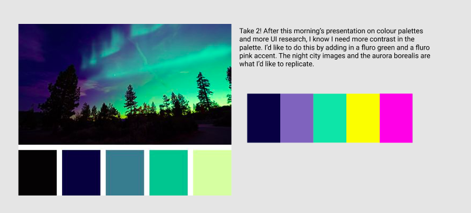
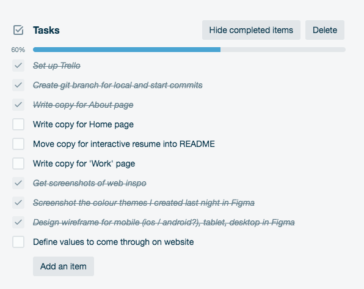
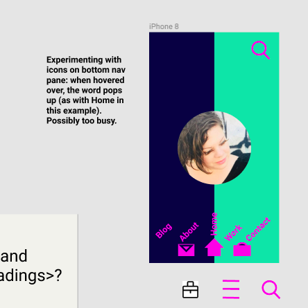
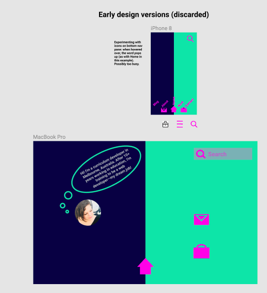
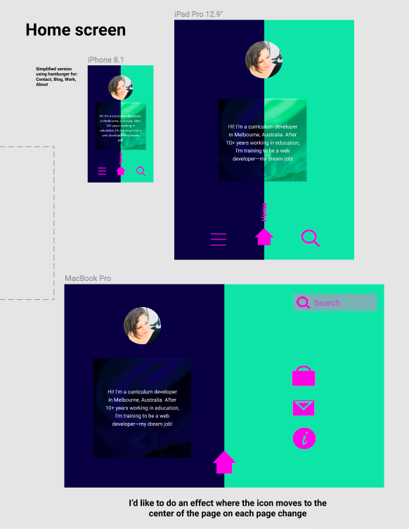
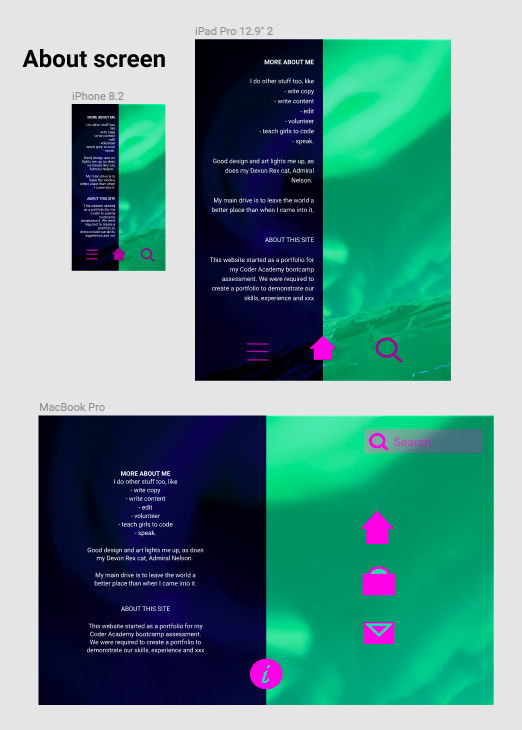

# portfolio
Web portfolio for Coder Academy bootcamp assessment

**DAY 1 SPRINT**

My aim today is to
- set up Trello
- set up Github repo
- complete copy writing
- complete selection of colour theme
- design wireframes
- take screenshots of progress 
- minimise image sizes of screenshots
- add screenshots into README
- if time, bring forward some of tomorrow's tasks e.g. spike.

**Project management**

*Github*

I set up Github this morning and started adding planning notes into the README file. I've also created an Images folder to store images in.

*Figma*

I created some colour pallettes last night from a Klimt painting that I love (see screenshot below). The feeling of dark colours with bright highlights was what I felt like playing with intuitively for my portfolio. 

Colour palette planning in Figma

When I thought about it, it was the colours from a photo of a big city after rain at night, with neon lights and blurred streelights that I was trying to get. I remembered a wall decorated for a Wed Anderson movie where there was a night scene with lights where the city buildings were like paper cut outs. I loved it so much, so I tracked down a picture of that and found a couple others for inspiration. I added these into Trello so I could refer back to them. 

Update on colour palette

I needed more contrast and wanted brighter colours (like the aurora borealis or the neon lights I'd thought of earlier). Played with those and I've decided that this is the colour palette I'll start wireframes with. Maybe with a more fluro yellow... :)

Colour palette planning in Figma—Take 2!

*Trello*

I set up Trello with days organised as sprints with daily retrospectives up until Friday (see screenshot 1. I've allocated tasks to each day and labelled each rubric criteria with the days that its areas are being worked on. Screenshot 2 shows Day 1 (Tuesday's) tasks. 

Screenshot 1: Day 1 trello set up

Screenshot 2: Day 1 task card—inspiration

Screenshot 3: Day 1 task list

**Portfolio requirements**

Notes from Leah when going through rubric: 
- try a spike (e.g. 2 hours) early on to consider whether technically the design is appropriate given the timeframe and assessment parameters
- RE images: minimise image sizes, try 1MB or lower if poss. 
- By tomorrow lunch, get approval on design
- To try multiple browsers, go to diff. browser e.g. Firefox, clear cache and load it in to check loading time / how fonts work etc. 
- RE font, 'less is more', e.g. one heading font / one other font or all same font with diff. weights
- Could try Hemgingway site
- RE tables, use tables in readme (Leah to clarify)
  
**Draft copy**

> Overall vibe/tone

- Friendly, conversational
- Light-hearted and playful
- Joy filled with touches of darkness

> Overall look
- dark
- colourful verging on fluro accents

> Home page

Hi! I'm a curriculum developer in Melbourne, Australia. After 10+ years working in education, I'm training to be a web developer—my dream job! 

I do other stuff too, like
- wite copy
- write content
- edit
- volunteer
- teach girls to code
- speak.

Good design and art lights me up, as does my Devon Rex cat, Admiral Nelson. 

My main drive is to leave the world a better place than when I came into it.

> About this site

This website started as a portfolio for my Coder Academy bootcamp assessment. We were required to create a portfolio to demonstrate our skills, experience and xxx

> History of internet (w/graphic)

> Work

**End of day 1 update**

- Copy not finished bc Aaron recommended getting wireframes done earlier to get approval. 
- Got approval for design after showing home screens and 'About' screens in Figma. 
- I added in an image of the aurora borealis for visual interest after trying block colours, a triangle shape for text and a speech bubble, but finding all of these were too strong or busy to look good. 
- For the layout, I brainstormed what pages I needed while looking at the rubric, and settled on 
- - 'Contact' for links (Github / linkedin) and contact details
- - 'About' for more info about me and info about the page
- - 'Work' for examples of my work / experience / skills
- - 'Home' for home page with tiny hello message and icons. 

Checklist at end of Day 1

All tasks except copy were completed. I will complete those today or tomorrow. 

*Icons*

I created icons for each page (About, Home, Work, Contact) on the website by using the shapes in Figma. I made these simple, recognisable images, taking into account the principle of familiarity/recognisability in User-centred design.

Screenshots of design 

Early designs that were scrapped

Approved Home screen designs

Approved About screen designs

